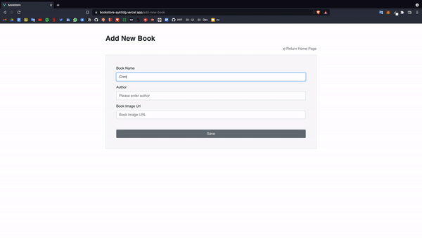

# Bookstore



## Demo:

Online deployment of this project is available at [Bookstore](https://bookstore.ayktldg.vercel.app/).

You can use the below credentials to test the app.

#### Adding a book to the store: 
```
Book Name: Crime and Punishment
Author: Dostoyevski
Book Image URL: https://bit.ly/335h41V
```
#### Assigning a book to a user: 
```
Identity Number: 123456
User Fullname: John Doe
User Address: Happystraat 12 Amsterdam
```

## Features
- Adding books to the library with the book title, author, and image Url.
- Assigning a book to the user.
- Retaking books from user
- Checking book status and deleting books from the book list.

## Technologies
Vue, Vuex, Vue-Router, Bootstrap, Bootstrap-vue, uuid, Vue Notification, Vee Validate, Vue Simple Alert, Vuex Persist

## Project setup
```
yarn install
```

### Compiles and hot-reloads for development
```
yarn serve
```

### Compiles and minifies for production
```
yarn build
```

### Run your unit tests
```
yarn test:unit
```

### Lints and fixes files
```
yarn lint
```

### Customize configuration
See [Configuration Reference](https://cli.vuejs.org/config/).
